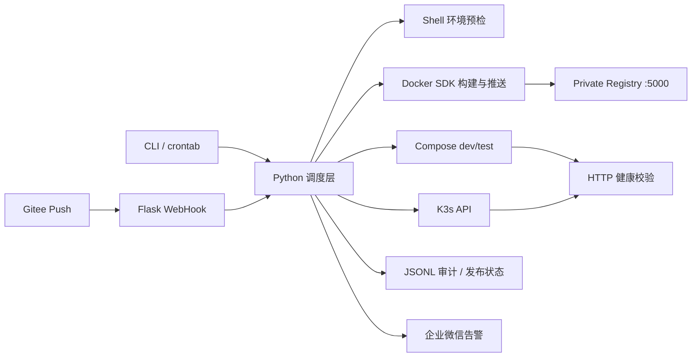

# Auto Deploy Platform

一个面向学习、面试展示和单机实验环境的自动发布平台。代码存放在 Windows 工作区，所有部署命令从 WSL Ubuntu 执行；容器运行时使用 Docker Desktop，Kubernetes 使用 WSL 内的单机 K3s。

当前工作区路径：

```text
Windows: D:\LYW\VSCode\OPS\auto-deploy-platform
WSL:     /mnt/d/LYW/VSCode/OPS/auto-deploy-platform
WSL IP:  172.24.105.133（WSL 重启后可能变化）
```

## 能力清单

| 模块 | 已实现能力 |
| --- | --- |
| Shell 工具 | 磁盘/端口/Docker/K8s/网络预检、MySQL 与配置备份、日志压缩清理、crontab 示例 |
| 镜像管理 | Git clone/pull、多阶段构建、环境 Tag、私有 Registry 推送、悬空镜像清理 |
| Compose 引擎 | dev/test 隔离、Web + Redis + MySQL、Nginx 网关、健康检查、重启/停止/扩容、失败自动回滚 |
| K3s 引擎 | Deployment、NodePort Service、ConfigMap、可选 Secret、滚动更新、就绪探测、失败自动回滚 |
| 发布管控 | 操作人/时间/版本/环境/结果 JSONL 审计，最近 50 次成功发布状态，HTTP 健康探测 |
| CI 与告警 | Gitee Push WebHook、Token/分支校验、后台串行发布、企业微信机器人失败告警 |

## 架构



Compose 使用 `gateway` 统一暴露端口，`web` 不绑定宿主机端口，因此 `web` 可以扩容多个副本而不发生端口冲突。K3s 中 ConfigMap 数据的哈希会写入 Pod Template 注解，配置变化也会触发滚动更新。

## 目录

```text
auto-deploy-platform/
├── .vscode/                 # WSL Python 解释器与调试入口
├── app_dockerfile/          # Flask 示例业务和多阶段 Dockerfile
├── config/
│   ├── compose/             # dev/test Compose 与 Nginx 配置
│   ├── k8s-tpl/             # Deployment/Service/ConfigMap 模板
│   ├── registry/            # 私有 Registry Compose
│   ├── env_dev.yaml
│   ├── env_test.yaml
│   └── crontab.example
├── scripts/                 # 预检、备份、轮转、K3s 安装脚本
├── src/                     # Python 调度、构建、发布、审计、Webhook、告警
├── tests/                   # 不依赖真实集群的单元测试
├── logs/                    # 轮转运行日志
└── releases/                # JSONL 审计和各引擎发布状态
```

## 1. 初始化 WSL 环境

在 VSCode 中使用 `WSL: Open Folder in WSL` 打开项目，然后在 WSL 终端执行：

```bash
cd /mnt/d/LYW/VSCode/OPS/auto-deploy-platform

sudo apt-get update
sudo apt-get install -y python3-venv curl git

mkdir -p /home/y/.venvs
python3 -m venv /home/y/.venvs/auto-deploy-platform
/home/y/.venvs/auto-deploy-platform/bin/pip install \
  -i https://pypi.tuna.tsinghua.edu.cn/simple \
  -r requirements-dev.txt

test -f .env || cp .env.example .env
chmod 600 .env
chmod +x scripts/*.sh
```

编辑 `.env`，至少替换 `MYSQL_ROOT_PASSWORD` 和 `MYSQL_PASSWORD`。`.env`、日志、备份和发布状态均已加入 `.gitignore`。

当前工作区已经生成了本机专用 `.env` 并与现有 MySQL Volume 同步；不要再次用示例文件覆盖它。需要轮换密码时，先修改 MySQL 用户密码，再修改 `.env` 并重新发布 Compose。

确认 Docker Desktop 已开启 `Settings -> Resources -> WSL Integration -> Ubuntu-26.04`：

```bash
docker info
docker compose version
```

不要在 WSL 中再安装一套 Docker daemon，否则 Docker Desktop 和 WSL Docker 容易使用不同镜像与网络。

## 2. 启动私有 Registry

```bash
docker compose -f config/registry/docker-compose-registry.yml up -d
curl http://127.0.0.1:5000/v2/
```

成功时 Registry 返回 `{}`。默认镜像格式为：

```text
localhost:5000/demo-app:<版本>-<环境>
localhost:5000/demo-app:v1.0.0-dev
localhost:5000/demo-app:v1.0.0-test
```

## 3. Compose 发布

完整流水线依次执行环境预检、构建、推送、发布、健康检查和审计：

```bash
PY=/home/y/.venvs/auto-deploy-platform/bin/python

$PY -m src.main check --env dev --engine compose
$PY -m src.main pipeline --env dev --engine compose --version v1.0.0
curl http://127.0.0.1:18080/
curl http://127.0.0.1:18080/health
```

test 环境使用独立 Compose Project、Volume 和端口 `28080`：

```bash
$PY -m src.main pipeline --env test --engine compose --version v1.0.0
curl http://127.0.0.1:28080/health
```

常用管控命令：

```bash
$PY -m src.main status --env dev --engine compose
$PY -m src.main compose --env dev scale --replicas 3
$PY -m src.main compose --env dev restart
$PY -m src.main compose --env dev stop
$PY -m src.main rollback --env dev --engine compose
$PY -m src.main cleanup-images --env dev
$PY -m src.main audit --limit 20
```

回滚需要至少有两个不同版本成功发布。新版本健康检查超时后，程序会自动恢复到状态文件中的上一个成功镜像。

## 4. 安装并发布到 K3s

K3s 只需安装一次：

```bash
./scripts/setup_k3s.sh  # 国内网络默认使用 K3s 官方文档给出的 cn 镜像
kubectl get nodes
```

让 K3s 的 containerd 信任实验用 HTTP Registry，然后重启 K3s：

```bash
REGISTRY_ADDRESS=localhost:5000 ./scripts/configure_k3s_registry.sh
kubectl get --raw=/readyz
```

如果国内网络导致 `kube-system` Pod 因 Docker Hub 超时长期停在 `ContainerCreating`，可通过 Docker Desktop 拉取当前集群实际引用的系统镜像并导入 K3s containerd：

```bash
./scripts/import_k3s_system_images.sh
kubectl -n kube-system get pods
```

执行发布：

```bash
$PY -m src.main check --env dev --engine k8s
$PY -m src.main pipeline --env dev --engine k8s --version v1.1.0

kubectl -n auto-deploy-dev get deployment,pod,service,configmap
curl http://127.0.0.1:30080/health
$PY -m src.main status --env dev --engine k8s
$PY -m src.main rollback --env dev --engine k8s
```

上述命令从 WSL 内执行。Windows 浏览器访问 NodePort 时使用当前 WSL IP，例如 `http://172.24.105.133:30080/health`；WSL 重启后用 `hostname -I` 更新地址。

dev/test 分别使用命名空间 `auto-deploy-dev`、`auto-deploy-test` 和 NodePort `30080`、`30081`。

如果 K3s 无法通过 `localhost:5000` 拉取 Docker Desktop 中的 Registry，将 `config/env_*.yaml` 的 `registry.address` 与注册表脚本参数统一改成当前 WSL IP，例如 `172.24.105.133:5000`，然后重新构建推送。用 `hostname -I` 获取当前地址，不要长期假定 WSL IP 固定。

### 可选 Secret

默认示例在 K3s 中关闭 Redis/MySQL 依赖检查，只演示请求中要求的 Deployment、Service 和 ConfigMap。如果业务需要敏感变量：

```bash
kubectl -n auto-deploy-dev create secret generic demo-app-secret \
  --from-literal=MYSQL_PASSWORD='replace-me'
```

再把 `config/env_dev.yaml` 中 `k8s.secret_name` 改为 `demo-app-secret`。程序会通过 `envFrom.secretRef` 引用已有 Secret，不会把 Secret 明文写入审计日志。

## 5. Gitee WebHook

先把 `config/env_dev.yaml` 的 `source.repository` 改为业务仓库 HTTPS/SSH 地址，并确认 WSL 已配置读取该仓库的凭据。Webhook 会精确检出 Gitee 事件中的完整提交 SHA，镜像 Tag 使用前 12 位，OCI revision 标签保存完整 SHA。

先在 `.env` 中设置随机 Token，然后导出变量并启动服务：

```bash
set -a
source .env
set +a
$PY -m src.main webhook --host 0.0.0.0 --port 9000
```

Gitee 仓库 WebHook 配置：

- URL：`http://可被Gitee访问的地址:9000/webhook/gitee`
- 密码：与 `GITEE_WEBHOOK_TOKEN` 相同
- 事件：Push

`172.24.105.133` 是私网 WSL 地址，公网 Gitee 无法直接访问。需要使用你可控的 HTTPS 反向代理/内网穿透，或在能访问该内网的自建 Gitee 上测试。不要把无 Token 的 WebHook 暴露到公网。

本地模拟：

```bash
curl -X POST http://127.0.0.1:9000/webhook/gitee \
  -H 'Content-Type: application/json' \
  -H 'X-Gitee-Event: Push Hook' \
  -H "X-Gitee-Token: $GITEE_WEBHOOK_TOKEN" \
  -d '{"ref":"refs/heads/main","after":"1234567890abcdef1234567890abcdef12345678"}'
```

服务立即返回 `202`，后台运行流水线；`GET /health` 可查看最近任务结果。并发 Push 返回 `409`，避免同一环境发生交叉发布。

## 6. 企业微信告警

把群机器人地址写入 `.env` 的 `WECHAT_WEBHOOK_URL`。任一 CLI 流程失败时会发送 Markdown 告警；变量为空时自动禁用，不影响发布。

## 7. 备份、日志与 crontab

手工备份：

```bash
set -a; source .env; set +a
$PY -m src.main backup --env dev
./scripts/log_clean.sh
```

备份包含 MySQL 一致性导出、配置压缩包和 SHA-256 校验文件，默认保留 14 天。定时任务示例：

```bash
crontab config/crontab.example
crontab -l
```

生产环境不要直接覆盖现有 crontab；应使用 `crontab -e` 合并需要的两行。

## 8. 测试与排错

```bash
$PY -m pytest
bash -n scripts/*.sh
APP_IMAGE=localhost:5000/demo-app:v1-dev \
  docker compose --env-file .env.example \
  -f config/compose/docker-compose-dev.yml config --quiet
```

关键文件：

- `logs/platform.log`：程序调试日志，Python 内置 RotatingFileHandler 自动轮转。
- `releases/audit.jsonl`：每次构建、发布、回滚、扩缩容的不可变追加审计记录。
- `releases/dev-compose-state.json`：Compose 最近成功镜像和历史。
- `releases/dev-k8s-state.json`：K3s 最近成功镜像和历史。

常见问题：

| 现象 | 检查方式 |
| --- | --- |
| `Docker daemon is unavailable` | Docker Desktop 是否启动并开启 WSL Integration；执行 `docker context ls` |
| Registry 预检失败 | `docker compose -f config/registry/docker-compose-registry.yml ps` 和 `curl 127.0.0.1:5000/v2/` |
| Compose 卡在 unhealthy | `docker compose -p auto-deploy-dev -f config/compose/docker-compose-dev.yml logs --tail=100` |
| K3s `ImagePullBackOff` | `kubectl describe pod`，检查 `/etc/rancher/k3s/registries.yaml` 与镜像 Registry 地址一致 |
| K3s 发布超时 | `kubectl -n auto-deploy-dev get pods -w` 和 `kubectl -n auto-deploy-dev describe deployment demo-app` |
